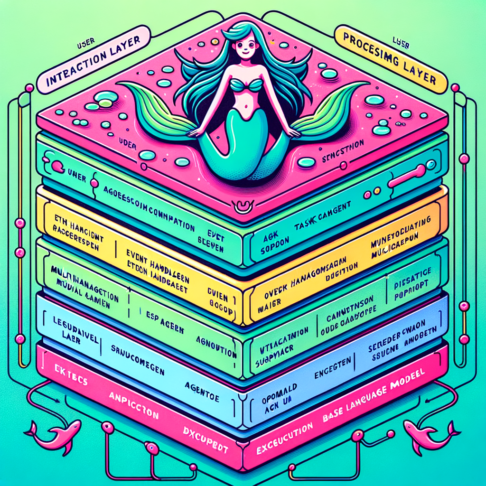
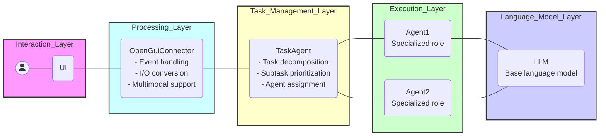
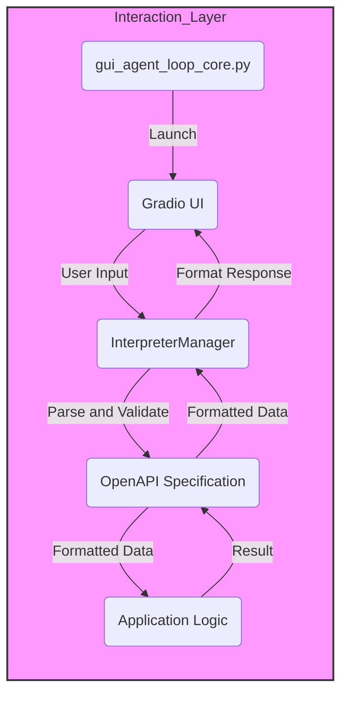

# GuiAgentLoopCore

## Architecture Diagram

### Interaction_Layer - Processing_Layer

## What is GuiAgentLoopCore?

Core logic of GUI and LLM agent bridge, including loop and controls.

## Getting Started

### Prerequisites

### Installation

## Usage

* Documentation: <https://nobu007.github.io/GuiAgentLoopCore>
* GitHub: <https://github.com/nobu007/GuiAgentLoopCore>
* PyPI: <https://pypi.org/project/GuiAgentLoopCore/>
* Free software: MIT

## Features

* TODO

## Credits

This package was created with [Cookiecutter](https://github.com/audreyr/cookiecutter) and the [waynerv/cookiecutter-pypackage](https://github.com/waynerv/cookiecutter-pypackage) project template.
